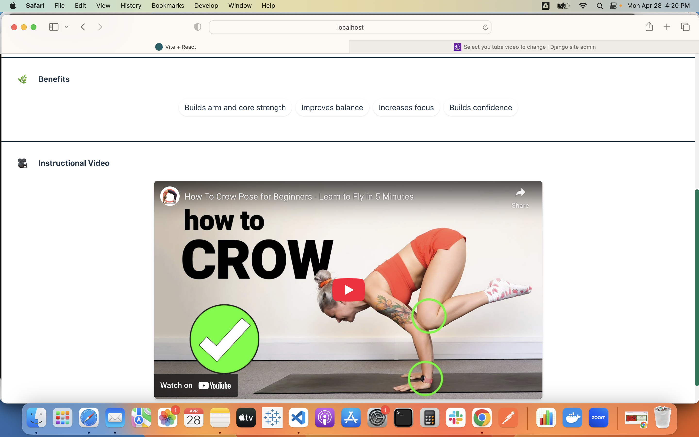

# Daily Yoga App

A full-stack web application that helps users discover yoga poses, learn their benefits, and follow curated video instructions designed for mindfulness and strength.

## Screenshots

### Home Page


### Pose Details


### Routines View


## Features

- **Pose Library**: Browse a comprehensive collection of yoga poses with detailed information
- **Featured Routines**: Explore curated yoga routines filtered by difficulty level
- **Instructional Videos**: Follow along with guided video instructions for each pose
- **User Authentication**: Simple login/logout functionality for a personalized experience

## Tech Stack

### Frontend
- React
- React Router for navigation
- Tailwind CSS for styling
- Axios for API requests

### Backend
- Django
- Django REST Framework for API endpoints
- PostgreSQL database
- Authentication with Django's built-in token system

## Installation and Setup

### Prerequisites
- Python 3.8+
- Node.js and npm
- PostgreSQL

### Backend Setup

1. Clone the repository:
   ```bash
   git clone https://github.com/yourusername/daily-yoga-app.git
   cd daily-yoga-app
   ```

2. Create and activate a virtual environment:
   ```bash
   python -m venv venv
   source venv/bin/activate  # On Windows: venv\Scripts\activate
   ```

3. Install dependencies:
   ```bash
   pip install -r requirements.txt
   ```

4. Set up environment variables:
   Create a `.env` file in the project root directory with the following variables:
   ```
   DB_NAME=your_db_name
   DB_USER=your_db_user
   DB_PASSWORD=your_db_password
   DB_HOST=localhost
   DB_PORT=5432
   API_Key=your_youtube_api_key
   ```

5. Run migrations:
   ```bash
   python manage.py migrate
   ```

6. Create a superuser:
   ```bash
   python manage.py createsuperuser
   ```

7. Start the backend server:
   ```bash
   python manage.py runserver
   ```

### Frontend Setup

1. Navigate to the frontend directory:
   ```bash
   cd yoga-frontend
   ```

2. Install dependencies:
   ```bash
   npm install
   ```

3. Start the development server:
   ```bash
   npm run dev
   ```

4. Access the application at `http://localhost:5173`

## Project Structure

```
daily-yoga-app/
├── yoga_backend/         # Django project directory
│   ├── yoga/             # Main Django app
│   │   ├── models.py     # Database models
│   │   ├── views.py      # API endpoints
│   │   ├── auth_views.py # Authentication views
│   │   ├── urls.py       # URL routing
│   │   └── admin.py      # Admin configuration
│   └── yoga_backend/     # Project settings
├── yoga-frontend/        # React frontend
│   ├── src/              # Source files
│   │   ├── components/   # React components
│   │   ├── Home.jsx      # Home page
│   │   ├── App.jsx       # Main application component
│   │   └── context/      # Context providers
│   ├── package.json      # npm dependencies
│   └── tailwind.config.js # Tailwind CSS configuration
└── requirements.txt      # Python dependencies
```

## API Endpoints

- `GET /api/poses/`: Get a list of all yoga poses
- `GET /api/poses/<slug>/`: Get details for a specific pose
- `POST /api/register/`: Register a new user
- `POST /api/login/`: Login a user
- `POST /api/logout/`: Logout a user

## Future Enhancements

- User progress tracking
- Personal routine creation
- Timer functionality for pose practice
- Mobile application version
- Social sharing functionality

## Contributing

1. Fork the repository
2. Create a feature branch: `git checkout -b feature-name`
3. Commit your changes: `git commit -m 'Add some feature'`
4. Push to the branch: `git push origin feature-name`
5. Submit a pull request

## License

This project is licensed under the MIT License - see the LICENSE file for details.

## Acknowledgements

- Yoga pose information sourced from verified yoga resources
- Video content from professional yoga instructors
- Tailwind CSS for the modern UI design
- React and Django communities for their excellent documentation